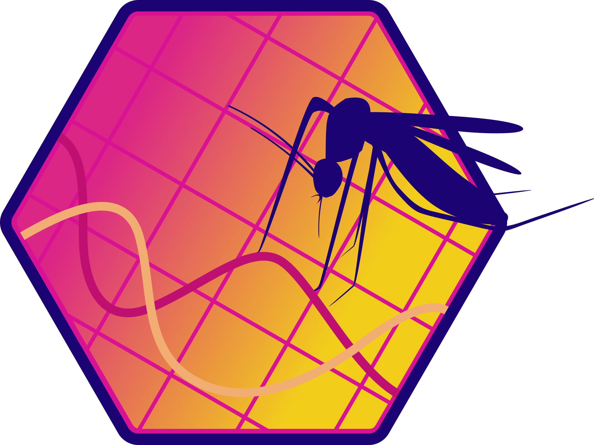

<!-- README.md is generated from README.Rmd. Please edit that file -->

# dynamAedes 

<!-- badges: start -->

[](https://cran.r-project.org/package=dynamAedes)
<!-- [](https://github.com/r-lib/testthat/actions) -->
<!-- [](https://app.codecov.io/gh/r-lib/testthat?branch=main) -->
<!-- badges: end -->

## Overview

**dynamAedes** is a stochastic, time-discrete and spatially-explicit population dynamical model for four invasive *Aedes* mosquito species: *Aedes aegypti*, *Ae. albopictus*, *Ae. japonicus* and *Ae. koreicus*.

The model is driven by temperature, photoperiod and intra-specific
larval competition and can be applied to three different "spatial scales":
punctual, local and regional. These modes consider different
degrees of spatial complexity and data availability, for example by accounting for
active and passive dispersal of mosquitoes or for specific input temperature data (weather station vs. gridded remotely-sensed temperature data).

The main features of **dynamAedes** are:

-   It allows to simulate the active and passive dispersal of adult mosquitoes (when *scale="local"*).

-   It's a stochastic model, thus the distribution of its output metrics (e.g., number of adults) integrates "random" variation and can thus differ slightly between different model runs.

-   It provides four functions (*psi*, *adci*, *dici* and *icci*) to easily derive summary metrics (i.g., based on user-defines quantiles) on the space-time trend of the simulated population dynamics, e.g., the 95% CI of the population dispersal in a given period or the number of cells colonised.

## Installation

``` r
# Install the released version from CRAN
install.packages("dynamAedes")
# Or the development version from GitHub:
# install.packages("devtools")
devtools::install_github("mattmar/dynamAedes")
```